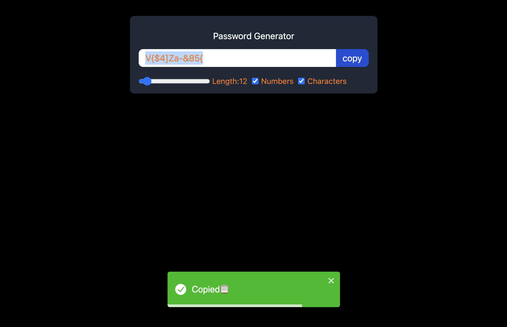

# Password Generator React Project



This is a simple yet powerful password generator web application built using React, Vite, and Tailwind CSS. It allows you to generate strong and secure random passwords with ease. You can customize the password length, include numbers and special characters, and copy generated passwords to your clipboard. Additionally, this project demonstrates the use of `useCallback` and `useRef` hooks for performance optimization and features a notification system powered by React-toastify.

Try it out: [Live Demo](https://pasword-generator-five.vercel.app/)

## Table of Contents

- [Features](#features)
- [Installation](#installation)
- [Usage](#usage)
- [Technologies](#technologies)
- [Contributing](#contributing)
- [License](#license)

## Features

- Generate random passwords with customizable settings.
- Choose the password length from 6 to 100 characters.
- Include numbers and special characters in generated passwords.
- Copy passwords to the clipboard with a single click.
- Receive a notification ("Copied") upon successful copying.
- Utilizes `useCallback` and `useRef` hooks in React for optimized performance.
- Responsive design using Tailwind CSS for a great user experience.
- Easily deployable on Vercel or your preferred hosting platform.

## Installation

To run this project locally, follow these steps:

1. Clone the repository:

   ```bash
   git clone https://github.com/roktim32/Pasword-Generator.git
   ```

2. Change into the project directory:

   ```bash
   cd password-generator
   ```

3. Install dependencies:

   ```bash
   npm install
   ```

4. Start the development server:

   ```bash
   npm run dev
   ```

5. Open your browser and visit [http://localhost:5173](http://localhost:5173) to use the password generator.

## Usage

1. Adjust the password length by moving the slider or manually entering a value between 6 and 100 characters.

2. Optionally, click the "Include Numbers" and "Include Special Characters" buttons to customize your password further.

3. Click the "Generate Password" button to generate a random password based on your selected criteria.

4. Click the "Copy" button to copy the generated password to your clipboard. A notification will appear briefly at the bottom of the screen, indicating that the password has been copied.

## Technologies

- **React**: A JavaScript library for building user interfaces.
- **Vite**: A fast, opinionated web dev build tool.
- **Tailwind CSS**: A utility-first CSS framework for quickly building custom designs.
- **React-toastify**: A popular library for adding notifications to React applications.

## Contributing

If you'd like to contribute to this project, please follow these guidelines:

1. Fork the repository.
2. Create a new branch for your feature or bug fix: `git checkout -b feature-name`.
3. Commit your changes: `git commit -m 'Add some feature'`.
4. Push to your fork: `git push origin feature-name`.
5. Create a new pull request.

## License

This project is licensed under the [MIT License](LICENSE).
